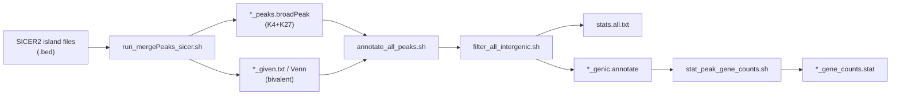

# 04_Bivalent_analysis

Identification of bivalent domains and analysis of three histone modification categories (H3K4me3‑only, H3K27me3‑only, bivalent) across developmental stages and species.

## Overview

Bivalent domains are chromatin regions co‑marked by both H3K4me3 (active) and H3K27me3 (repressive). This module:

1. **Converts** SICER2 island files to broadPeak format
2. **Identifies** bivalent domains using HOMER `mergePeaks` (≥1 bp overlap)
3. **Classifies** peaks into K4‑only, K27‑only, and bivalent
4. **Annotates** all three peak types to nearest genes
5. **Filters** intergenic regions
6. **Counts** unique genes for each category

## Workflow


## Directory contents

| File | Description |
|------|-------------|
| `run_mergePeaks_sicer.sh` | Convert SICER2 island files to broadPeak and identify three peak categories |
| `annotate_all_peaks.sh` | Annotate bivalent, K4‑only, and K27‑only peaks to nearest genes |
| `filter_all_intergenic.sh` | Remove intergenic peaks and generate annotation type statistics |
| `stat_peak_gene_counts.sh` | Count unique genes for each peak category |
| `mouse1.filter.stat` | Example peak count statistics file (input format reference) |

## Usage

### Step 1: Peak classification

```bash
bash run_mergePeaks_sicer.sh 2_cell 4_cell 8_cell morula ICM TE
```
This generates `*_peaks.broadPeak` files for K4 and K27 at each stage, plus `*_given.txt` (bivalent overlap) and `*_given.venn.txt` (count statistics).

### Step 2: Annotate all peaks

```bash
bash annotate_all_peaks.sh mm10 2_cell 4_cell 8_cell morula ICM TE
```

**Output**: `*_biv.annotate`, `*_K27only.annotate`, `*_K4only.annotate` for each stage.

### Step 3: Filter intergenic regions

```bash
bash filter_all_intergenic.sh
```

**Output**: `*_genic.annotate` files (intergenic removed) and `stats.all.txt` (annotation type statistics).

### Step 4: Count genes per category

```bash
bash stat_peak_gene_counts.sh mouse1
```

**Output**: `mouse1_gene_counts.stat` with columns: `sample`, `GeneCounts`, `Group`.

## Input file format

### `.filter.stat` (for peak count plot, see `Figures/`)

```
sample	PeakCounts	Group
2_cell_K27Me3	12651	k27_monovalent
2_cell_K4Me3	37866	k4_monovalent
2_cell_biv	3627	bivalent
```

### `.gene.stat` (for gene count plot, see `Figures/`)

```
sample	GeneCounts	Group
2_cell_K27Me3	8472	k27_gene
2_cell_K4Me3	15234	k4_gene
2_cell_biv	2103	biv_gene
```

## Bivalent definition

Bivalent domains are defined as genomic regions where H3K4me3 and H3K27me3 peaks **overlap by at least 1 bp**, using `mergePeaks -d given`.

## Figure code

The R scripts for generating **Figure 3‑9** (peak counts) and **Figure 3‑10** (gene counts) are located in the `Figures/` directory at the repository root. Input data files for all six species are provided in `Figures/data/`.

## Software requirements

- HOMER v4.11
- bedtools v2.30.0
- R with packages: `ggplot2`, `cowplot`